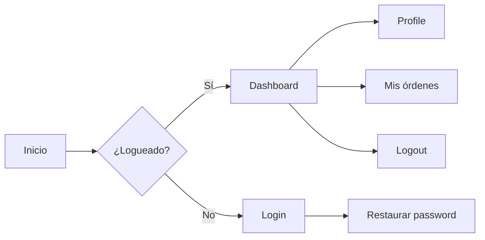
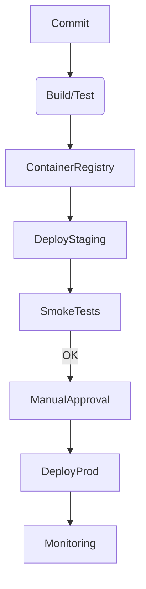
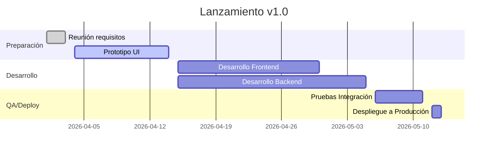

# Resumen Ejecutivo

La documentación centralizada de un proyecto de software es **esencial**: facilita el trabajo de los desarrolladores, mejora la experiencia del usuario y asegura la continuidad del proyecto a largo plazo【4†L49-L54】. Este informe presenta una guía exhaustiva para crear y mejorar cada sección de la documentación de una aplicación web, abordando aspectos desde el inventario de páginas hasta métricas de negocio y gobernanza. Para cada elemento se incluye su propósito, herramientas recomendadas (con énfasis en recursos oficiales y en español), configuración mínima, ejemplos concretos, ventajas y desventajas, así como pasos de implementación. Se presentan comparativas de herramientas en tablas y diagramas Mermaid (arquitectura, flujos, cronogramas). Se asume stack **sin restricción**: cuando corresponda, se ofrecen opciones para stacks comunes (React/Vue/Angular + Node/Python/Go + Docker + Kubernetes) y se destacan sus diferencias. También se propone una estructura de sitio de documentación (secciones, plantillas de página) con ejemplos de contenido, así como plantillas tipo README, ADR y runbook, checklists de calidad y métricas/dashboards de negocio y producto. El objetivo es que cualquier miembro (desarrollador, gestor o usuario) entienda en profundidad el proyecto y su contexto. 

## Inventario de Páginas, Rutas y Flujos de Usuario

**Propósito:** Mapa completo de la aplicación (sitemap) que describa cada página o vista y sus rutas URL asociadas. Sirve para entender la navegación global, facilitar pruebas de integración y orientar nuevos colaboradores.  

**Herramientas recomendadas:** Generadores de sitemap (como [Sitemap XML](https://support.google.com/webmasters/answer/183668?hl=es)), scripts de crawling (Screaming Frog, plugins de IDE) o frameworks (por ejemplo, Next.js tiene `getStaticPaths`). También se pueden documentar manualmente en Markdown o en herramientas de documentación (Docusaurus, MkDocs).  

**Configuración mínima:** Incluir al menos: ruta, descripción del propósito de la página, permisos de acceso, componentes principales y puntos clave (por ejemplo, rutas dinámicas o parámetros). Por ejemplo:

```
- **/** (Home): Pantalla inicial con resumen de métricas.
- **/login**: Formulario de autenticación de usuario.
- **/dashboard**: Vista protegida con panel de usuario (requiere login).
- **/products/:id**: Detalle de producto (ruta dinámica que muestra información y opciones de compra).
```

**Ejemplo concreto:** Un inventario podría ser una tabla con columnas “Ruta”, “Descripción”, “Componentes involucrados”, “Rol de usuario”:
| Ruta             | Descripción                    | Componente (ejemplo)   | Notas                 |
|------------------|--------------------------------|------------------------|-----------------------|
| `/`              | Página principal               | `HomePage`             | Slider, resumen global |
| `/login`         | Formulario de acceso           | `LoginForm`            | —                     |
| `/admin/users`   | Gestión de usuarios (admin)    | `UserList`, `UserEdit` | Autorización requerida|
| `/profile`       | Perfil de usuario conectado    | `ProfilePage`          | —                     |

**Pasos de implementación:** Recorrer la aplicación (manual o automatizado) y registrar rutas. En proyectos grandes, puede generarse un sitemap XML que luego se documenta en el sitio de docs. También es útil un diagrama de flujo del “User Journey”: 



## Catálogo de Componentes UI (Props, Estados, Ejemplos, Accesibilidad)

**Propósito:** Documentar cada componente de la interfaz como parte de un *Design System*. Facilita su reutilización, prueba, mantenimiento y asegura consistencia visual/funcional. Cada componente debe tener listado de *props* (propiedades/atributos), posibles estados, variantes (tamaños, colores) y ejemplos interactivos. Debe incluirse información de accesibilidad (atributos ARIA, roles, contrastes).  

**Herramientas recomendadas:** *Storybook* (tutorial en español disponible【6†L65-L72】) o alternativas como Vue Styleguidist, Angular Storybook, Bit.dev, Docz. Estas permiten crear un sitio interactivo donde cada componente se muestra con controles para modificar props. *Storybook* destaca por su ecosistema de add-ons y soporte multilenguaje. Para accesibilidad, se recomienda el addon `@storybook/addon-a11y`.  

**Configuración mínima:** Instalar Storybook (por ejemplo: `npx storybook init`) y crear un archivo de historias (`Component.stories.js(x)`) por componente. Incluir casos de uso normales y de borde (e.g. *error*, *disabled*, *activo*). Enumerar las props en una tabla dentro de la historia. Ejemplo (pseudo-código de componente React en Storybook):

```jsx
export default {
  title: 'Botón/Primary',
  component: PrimaryButton,
  args: {
    label: 'Enviar',
    disabled: false,
  },
  argTypes: {
    onClick: { action: 'click!' },
    disabled: { control: 'boolean' }
  }
};

export const Default = { args: {} };
export const Disabled = { args: { disabled: true } };
```

**Pros/Contras:** *Pro:* Facilita pruebas visuales y regresivas (with Storyshots) y la comunicación entre equipos. Permite testear y documentar UI aislada. *Contra:* Requiere mantener historias actualizadas; puede implicar tiempo extra al inicio.  

**Comparativa de herramientas** (UI components):

| Herramienta   | Stack        | Destaca por…                                     | Documentación Español |
|---------------|--------------|--------------------------------------------------|-----------------------|
| Storybook     | React/Vue/Angular | Comunidad amplia, addons (A11y, Controls, Docs). Integración con Chromatic (visual tests). | Sí【6†L65-L72】 (introducción) |
| Styleguidist  | React        | Enfocado en componentes React. Configuración rápida. | Parcialmente  |
| Bit.dev        | React/Vue/Angular | Distribuye y versiona componentes entre proyectos.   | No (en inglés)      |

*Pasos:* 1) Instalar Storybook; 2) Registrar cada componente con historias; 3) Añadir add-ons (prop documentation, accesibilidad); 4) Publicar (p.ej. GitHub Pages) o integrar con pipeline para verización continua.

## Diseño de Marca y Design Tokens

**Propósito:** Unificar identidad visual (colores, tipografías, logos, iconografía) y establecer design tokens (variables atómicas de diseño) para asegurar consistencia. Los *Design Tokens* son “decisiones pequeñas de diseño” (valores de color, espaciado, tipografía) codificados en variables reutilizables【10†L21-L29】. Actúan como **fuente de la verdad** común entre diseñadores y desarrolladores【10†L40-L48】.  

**Herramientas recomendadas:** Figma o Adobe XD para diseño visual y prototipos; librerías como [Style Dictionary](https://amzn.github.io/style-dictionary/) o [Theo](https://github.com/salesforce-ux/theo) para generar tokens multiplataforma. Estos permiten definir tokens en JSON o YAML y exportarlos a CSS, JSON, XML, etc. También se pueden usar frameworks de diseño (Bootstrap, Material UI) que soportan theming.  

**Configuración mínima:** Definir tokens básicos: paleta de colores (principal, secundario, error, etc.), tipografías (familias, tamaños), espaciados (márgenes padding), radios, sombras. Por ejemplo en JSON:

```json
{
  "color": {
    "primary": { "value": "#0055FF" },
    "secondary": { "value": "#FF5500" }
  },
  "fontSize": {
    "base": { "value": "16px" },
    "lg": { "value": "24px" }
  }
}
```

Y luego convertir a variables CSS (`:root { --color-primary: #0055FF; }`).  

**Pros/Contras:** *Pro:* Cambios globales sencillos (cambiar color en 1 lugar). Mejor colaboración diseño-dev y escalabilidad【10†L55-L63】. *Contra:* Sobrecarga inicial de definir tokens y cultura de update.  

**Tabla comparativa de herramientas de Design Token:**

| Herramienta    | Formatos de salida         | Integración           | Documentación Esp. |
|----------------|----------------------------|-----------------------|--------------------|
| Style Dictionary | JSON, CSS, SCSS, XML, Android, iOS | Plugins (npm, Ruby)     | Oficial (inglés)  |
| Theo           | JSON, JavaScript           | CLI, CI/CD            | Limitada          |
| Sass variables | (manual) CSS + SASS       | Nativo en SCSS         | Sí (Sass)         |
| CSS Custom Properties | —                   | Soporte nativo navegador | —               |

**Pasos de implementación:** 1) Crear un repositorio de “tokens” central. 2) Definir tokens primitivos (colores, tamaños). 3) Publicar tokens en librerías/componentes (usar npm, import). 4) Actualizar documentación de estilo (p.ej. Storybook) con ejemplos de uso de tokens. 5) Vincular tokens con herramientas de diseño (p.ej. [Figma Tokens plugin](https://docs.tokens.studio/figma)).

## Navegación y Vista en Múltiples Dispositivos

**Propósito:** Garantizar que la aplicación sea navegable y usable en diferentes tamaños de pantalla (móviles, tabletas, escritorio) y navegadores. Cubrir la “Vista Responsive” y su prueba.

**Herramientas recomendadas:**  
- **Frameworks CSS** (Bootstrap, Tailwind CSS, Material-UI) que incluyen breakpoints y utilidades responsivas.  
- **Componentes UI adaptativos** (Media queries CSS, CSS Grid/Flexbox).  
- **Pruebas de responsividad:** Browser dev tools (emulador de dispositivos Chrome), [BrowserStack](https://www.browserstack.com/) o [Responsinator](http://www.responsinator.com/) para probar en múltiples navegadores/dispositivos reales.  
- **Automatización:** Lighthouse (integrado en Chrome) para auditar móviles vs desktop, testeos de E2E con Cypress/Playwright con viewport configurables.

**Configuración mínima:** Definir puntos de ruptura (p.ej. 320px, 768px, 1024px) según audiencia; usar unidades fluidas (%, rem) en layouts. Documentar en la guía de estilo las reglas de diseño responsivo (cómo cambian los componentes según el ancho).  
**Ejemplo:** 

```css
/* Example breakpoints in Tailwind */
@media (min-width: 768px) { /* md */ ... }
@media (min-width: 1024px) { /* lg */ ... }
```

**Pros/Contras:** *Pro:* Mejora la experiencia de usuario en móviles y SEO. *Contra:* Requiere diseño extra y pruebas frecuentes (no hay "una sola vista" para todo).  

**Pasos:** 1) Definir diseño móvil primero (mobile-first). 2) Implementar media queries o utilidades CSS. 3) Revisar interacción táctil (touch targets), visibilidad (tipo grande) y navegación fluida. 4) Probar en varios navegadores/dispositivos (idealmente con BrowserStack en CI). 5) Documentar en sección “Responsive Design” con screenshots o emulaciones.

## Documentación de Componentes y Pruebas de UI

**Propósito:** Asegurar que cada componente cuente con documentación detallada (props, ejemplos, casos de uso) y que exista cobertura de pruebas UI (snapshot o visuales) para detectar regresiones.  

**Herramientas recomendadas:**  
- **Storybook + Addons:** Además de documentación interactiva, usar addons como [Storyshots](https://storybook.js.org/addons/storyshots) para generar tests de snapshot en Jest.  
- **Testing de componentes:** React Testing Library o Vue Test Utils con Jest/Vitest para pruebas unitarias de componentes.  
- **Pruebas visuales:** Herramientas como Chromatic (para Storybook) o Percy para detectar cambios visuales.  

**Configuración mínima:** Cada componente debe incluir al menos una historia en Storybook y pruebas básicas en el framework elegido. Ejemplo: para React, instalar `@storybook/addon-storyshots` y agregar en Jest:

```js
import initStoryshots from '@storybook/addon-storyshots';
initStoryshots();
```

Esto compara automáticamente la UI renderizada con los snapshots guardados en tiempo de desarrollo.  

**Ejemplos concretos:**  
- Uso de **Storybook** para desarrollar y documentar interactivamente (ver Catálogo de Componentes).  
- **React Testing Library**: testear interacciones de usuario en un componente, por ejemplo verificar que un texto aparece al hacer clic.  
- **Cypress**: tests E2E para flujos de UI completos (login, compra) comprobando componentes visuales críticos.  

**Pros/Contras:** *Pro:* Detecta errores de UI antes de llegar a producción, documentación viva. *Contra:* Curva de aprendizaje (p.ej. escribir tests E2E toma tiempo) y mantenimiento de snapshots.  

**Pasos de implementación:** 1) Integrar Storybook (ver arriba) y Storyshots. 2) Crear un directorio `__tests__` en componentes, escribir pruebas unitarias mínimas. 3) Configurar pipeline CI para ejecutar estas pruebas y reportar cobertura. 4) Incluir paso visual en CI (p.ej. Chromatic) para alertar cambios inesperados.  

## Testing en Varios Niveles

**Propósito:** Garantizar calidad mediante pruebas *unitarias*, *de integración*, *E2E*, además de pruebas de performance y seguridad. Estas niveles forman una pirámide de testing: base amplia de tests rápidos (unitarios) hasta tests E2E más lentos pero comprensivos.

- **Pruebas Unitarias:** Validan funciones y componentes aislados. Herramientas: **Jest**, **Mocha**, **Vitest** (Node), **JUnit** (Java). Para front, **Jest** + **React Testing Library** o **Vue Test Utils**.  
- **Pruebas de Integración:** Testean interacción entre módulos (p.ej. UI con servidor simulando API). Herramientas: **Jest** con entorno simulado, o herramientas específicas (p.ej. **TestCafe**).  
- **Pruebas E2E:** Simulan el flujo completo del usuario (login, compra). Herramientas: **Cypress**, **Playwright**, **Selenium**. (Cypress y Playwright son populares en JS).  
- **Pruebas de Performance:** Herramientas: **Lighthouse** (para web, mide rendimiento y accesibilidad), **k6** o **JMeter** (carga de backend).  
- **Pruebas de Seguridad:** Análisis de vulnerabilidades: **OWASP ZAP**, **Snyk** (dependencias), **Bandit** (Python), linters de seguridad (ESLint plugins).  

**Comparativa de frameworks de test:**

| Tipo de Test      | Herramienta        | Enfoque                     | Pros                              | Contras                         |
|-------------------|--------------------|-----------------------------|-----------------------------------|---------------------------------|
| Unitarias JS      | Jest, Vitest       | Código aislado              | Integración con babel, rápido     | Cobertura vs tests E2E          |
| Integración JS    | Jest, Mocha        | Componentes y servicios      | Sencillo con mocks                | Dificil replicar entornos reales|
| E2E (Navegador)   | Cypress, Playwright| Navegador real             | Simula usuario real, depuración fácil | Lento, frágil ante cambios UI   |
| Performance web   | Lighthouse         | Métricas de carga/perf.     | Integrado en Chrome, métricas automáticas | Sólo front-end, no backend/API  |
| Seguridad         | OWASP ZAP, Snyk    | Vulnerabilidades           | Detecta XSS, SQLi; analiza deps    | Falsos positivos; configuración  |

**Pasos de implementación:**  
1. Definir cobertura mínima (e.g. 80% código).  
2. Escribir tests unitarios para lógica crítica (usar Jest/Vitest).  
3. Tests de integración para flujos entre módulos (p.ej. login en UI + stub de API).  
4. Configurar script CI que corra tests unitarios/integración en cada push.  
5. Configurar tests E2E periódicos (por ejemplo, tras merge a `main`).  
6. Usar herramientas de análisis estático (eslint-plugin-security, etc.).  

## Herramientas de Debugging y Monitoreo

**Propósito:** Identificar y resolver errores tanto en desarrollo local como en producción, y monitorear la salud de la aplicación en tiempo real. Implica habilitar logging apropiado, depuración eficiente y alerts en producción.  

**Herramientas recomendadas (Debugging local):**  
- **DevTools del navegador:** perfiles de CPU/memoria, inspección DOM/elementos, Network tab.  
- **Extensiones de framework:** React Developer Tools, Vue Devtools.  
- **Librerías de logging en front-end:** `console.log` moderado, o libs como *loglevel* o *debug*.  
- **Depuradores IDE:** Breakpoints en VS Code / WebStorm (con sourcemaps).  

**Herramientas recomendadas (Monitoreo producción):**  
- **Errores JS:** Sentry, Bugsnag, Rollbar (capturan excepciones JS y stacktrace).  
- **Métricas de Aplicación:** Prometheus (metrics), Grafana (visualización), Elastic APM.  
- **Logs:** Elastic Stack (Elasticsearch + Kibana + Logstash), Loki + Grafana, Splunk.  
- **Rendimiento Real:** NewRelic, Dynatrace, Datadog (métricas de rendimiento y alertas).  
- **Seguimiento de Sesiones:** LogRocket, FullStory (reproduce errores del usuario).  

**Comparativa (Error Tracking):**

| Herramienta         | Enfoque                  | Pros                                 | Contras                         |
|---------------------|--------------------------|--------------------------------------|---------------------------------|
| Sentry              | Captura excepciones JS/Backend | Integración con muchos lenguajes (JS, Python, Go). Alertas configurables. | Plan gratuito limitado eventos.  |
| Rollbar             | Similar a Sentry         | Feed en tiempo real, análisis.        | UI menos intuitiva que Sentry.  |
| Bugsnag             | Errores + Rendimiento    | Crash reporting móvil/app + web.     | Costo creciente con volúmenes.  |

**Configuración mínima:** Ejemplo de Sentry en Node (JavaScript):

```js
// Instalar: npm install @sentry/node
const Sentry = require('@sentry/node');
Sentry.init({ dsn: 'https://<your-dsn>@sentry.io/<project>', tracesSampleRate: 1.0 });
```

Para front-end React: `@sentry/react`. En producción, envolver la app con `<ErrorBoundary>` de Sentry.  

**Pasos:**  
1. Establecer niveles de logging (DEBUG, INFO, WARN, ERROR) y formato uniforme.  
2. Integrar Sentry (o similar) en backend y frontend para capturar errores.  
3. Configurar dashboards de monitoreo (Grafana) con métricas clave (uso de CPU, respuestas tardías, errores 500).  
4. Definir alertas/SLI (p.ej. tasa de error >1% genera notificación).  
5. Para producción, habilitar Health checks y alertas (Slack/email) según SLOs.  

## Procesos de Desarrollo (Branching, Code Review, Linters, Formatters)

**Propósito:** Establecer flujo de trabajo claro para el equipo: ramas, revisiones de código, estilos y calidad antes de integrar cambios.  

- **Branching:** GitFlow (rama `develop`, `feature/*`, `release/*`, `hotfix/*`) o GitHub Flow (rama principal + PR). GitFlow aporta estructuración formal, GitHub Flow es más simple.  
- **Code Review:** Uso de Pull Requests en GitHub/GitLab/Azure DevOps. Definir políticas: número mínimo de revisores, aprobaciones requeridas. Documentar procesos en `CONTRIBUTING.md`.  
- **Linters/Formatters:** ESLint (JavaScript/TypeScript) con presets (Airbnb, etc) y Prettier para formato. En Python, Black (formateador) y Flake8. Automatizar en pre-commit con *husky* o pipeline.  
- **Convenciones de código:** Usar guías de estilo (p.ej. Google Style Guides). Integrar checks automáticos (CI) que rechacen código que no pase lint/test.  

**Comparativa de Branching Models:**

| Modelo       | Ventajas                        | Desventajas                 |
|--------------|---------------------------------|-----------------------------|
| GitFlow      | Control estricto (IDEAL releases planificados). Roles claros. | Puede ser pesado para equipos pequeños.        |
| GitHub Flow  | Simplicidad (main siempre lista). Bueno para despliegues frecuentes. | Menos claro en releases grandes.              |
| Trunk-based  | Deploy continuo, menos merge conflicts. | Requiere feature flags y disciplina; no ramas largas. |

**Pasos de implementación:**  
1) Definir convención de git branching (documentarlo). 2) Configurar plantilla de PR indicando checklist (tests OK, review by X). 3) Instalar ESLint/Prettier en proyecto, decidir reglas (por ejemplo usando `.eslintrc.js` con `"extends": "airbnb"`). 4) Configurar *pre-commit* (husky) para ejecutar linters antes de commits. 5) Agregar integración de lint/tests en CI (ver siguiente sección).

## CI/CD y Despliegue

**Propósito:** Automatizar la construcción, prueba y despliegue del proyecto para garantizar calidad consistente y despliegues repetibles. Se busca integrar IaC (infraestructura como código) y permitir rollback rápido en caso de error.  

**Herramientas recomendadas:**  
- **CI/CD:** GitHub Actions, GitLab CI/CD, Jenkins, Bitbucket Pipelines, CircleCI. Las documentaciones oficiales son completas (GitHub Actions [Docs](https://docs.github.com/es/actions)).  
- **Construcción de contenedores:** Docker con Dockerfile. Publicar imágenes en Docker Hub o registro privado.  
- **Orquestación:** Kubernetes (manifestos YAML, Helm charts) para despliegue en clústeres. Opciones alternativas: Docker Swarm, AWS ECS/Fargate.  
- **Infraestructura como Código:** Terraform, AWS CloudFormation o Azure Bicep para definir infraestructura de BD, redes, etc. Permiten “versionar” la infraestructura.  

**Configuración mínima:** Ejemplo de pipeline simple (GitHub Actions):

```yaml
name: CI
on: [push, pull_request]
jobs:
  build:
    runs-on: ubuntu-latest
    steps:
      - uses: actions/checkout@v3
      - name: Instalar Node
        uses: actions/setup-node@v3
        with: { 'node-version': '18' }
      - run: npm install
      - run: npm run lint
      - run: npm test
      - name: Build Docker Image
        run: docker build -t myapp:${{ github.sha }} .
      - name: Push Image
        run: |
          docker tag myapp:${{ github.sha }} myregistry/myapp:latest
          docker push myregistry/myapp:latest
```

**Comparativa CI/CD:**

| Herramienta       | Integración Docker/K8s | Facilidad de uso                | Documentación Esp. |
|-------------------|------------------------|---------------------------------|--------------------|
| GitHub Actions    | Integrado (acciones para Docker) | YAML sencillo, fácil integración GitHub | Sí (docs oficiales) |
| GitLab CI/CD      | Integrado (auto-scaling runners) | Integración GitLab, YAML completo | Parcialmente       |
| Jenkins           | Plugins Docker/K8s      | Muy configurable, open source   | Sí (Jenkins in Spanish) |
| Azure Pipelines   | Buen soporte Docker/K8s | Visual designer + YAML, integración Azure | Sí (docs)      |

**Pasos de implementación:**  
1. **CI Unitario:** Configurar pipeline que instale dependencias, ejecute linters y tests en cada push/PR. Marcar fallos si algo falla.  
2. **CI Build:** Construir artefacto (por ejemplo un contenedor Docker). Al final del CI, artefacto listo para deploy.  
3. **CD Deploy:** Dependiendo del entorno, puede ser: auto-deploy a staging tras merge a `develop`, y a producción desde `main` con manual approval. Usar IaC (Terraform) para aprovisionar infraestructura (bases de datos, colas).  
4. **Rollback:** Mantener versiones anteriores (p.ej. tags Docker) y scripts (`kubectl rollout undo`) para revertir.  
5. **Seguridad CI/CD:** Integrar scanner de dependencias (Snyk, Trivy) en pipeline para detectar vulnerabilidades antes del deploy.



## Onboarding y Guías para Contribuyentes

**Propósito:** Facilitar la incorporación de nuevos desarrolladores y colaboradores asegurando que tengan la información necesaria para configurar el entorno, entender el flujo de trabajo y contribuir adecuadamente.  

**Contenido recomendado:**  
- **CONTRIBUTING.md:** Instrucciones para reportar issues, estilo de código, proceso de PR.  
- **README principal:** Resumen del proyecto, requerimientos, pasos de instalación y “primeros pasos”.  
- **Set-up local:** Guía paso a paso para configurar entorno de desarrollo (clonar repo, variables de entorno, ejecutar servidores). Ejemplo:

  1. Clonar repositorio: `git clone ...`
  2. Copiar `.env.example` a `.env` y completar variables.
  3. Instalar dependencias (`npm install` o `pip install -r requirements.txt`).
  4. Levantar base de datos local (p.ej. con Docker: `docker-compose up -d db`).
  5. Correr migraciones y seed: `npm run migrate`.
  6. Iniciar servidor: `npm start`.

- **Guía de estilo:** Enlazar a convenciones de codificación (esLint rules, etc.).  
- **Onboarding técnico:** Puntos clave de la arquitectura, diagrama de alto nivel (ver siguiente sección).  
- **Mentoría:** Asignar un “padrino” o canal de Slack para dudas.  

**Herramientas útiles:**  
- Plantilla de *CONTRIBUTING.md* (GitHub ofrece [modelo](https://help.github.com/es/github/building-a-strong-community/setting-guidelines-for-repository-contributors)).  
- Video-tutoriales intro (opcional) alojados en Docs o Wiki.  
- Checklist interactivo (GitHub Issues Templates) para que el nuevo siga pasos.  

**Pasos:** 1) Crear archivos básicos (`README.md`, `CONTRIBUTING.md`) en el raíz del repo; 2) Detallar configuración de entorno; 3) Incluir un ejemplo de “Hello World” mostrando un cambio simple y PR; 4) Revisar y actualizar periódicamente para que el proceso siga vigente.

## Arquitectura Técnica

**Propósito:** Documentar la estructura del sistema para que cualquier persona (dev u otros stakeholders) comprenda cómo interactúan los componentes, servicios y datos. Se incluyen diagramas de alto nivel (arquitectura empresarial), de contenedores (aplicaciones), componentes y flujos de datos. Se sugiere usar modelos estandarizados como C4 o ArchiMate.  

- **Modelo C4:** Enfoque jerárquico (Contexto, Contenedores, Componentes, Código)【12†L18-L26】. Facilita claridad para públicos técnicos y no técnicos. Por ejemplo, un diagrama de contexto muestra el sistema web en su entorno (usuarios, sistemas externos)【12†L40-L49】.  

- **Diagrama de Contenedores:** Muestra apps front-end (React/Vue/Angular), back-end (Node/Python/Go APIs), BD y colas. Por ejemplo, un usuario (web) interactúa con SPA que llama a microservicios en Kubernetes【12†L62-L71】.  

- **Diagrama de Componentes:** Dentro de un contenedor (p.ej. el servicio Node.js) se identifican controladores, repositorios, bibliotecas internas【12†L82-L91】.  

- **Diagrama de despliegue:** Infraestructura (clúster Kubernetes, servidores Docker, cloud, redes).  

- **Herramientas:** Diagrams.net, [Visual Paradigm (ArchiMate)](https://blog.visual-paradigm.com/es/comprehensive-guide-to-archimate-diagrams/)【16†L139-L148】, [Structurizr](https://structurizr.com/) (C4), PlantUML con plugin C4. **Mermaid** permite generar diagramas en Markdown.  

```mermaid
flowchart LR
  subgraph Frontend
    UI[App (React/Vue/Angular)]
  end
  subgraph Backend
    API[API Service (Node/Python/Go)]
    Auth[Auth Service]
    DB[(Database)]
  end
  subgraph Infra
    K8s[Kubernetes Cluster]
    CI_CD[CI/CD Pipeline]
  end
  UI -->|HTTP/JSON| API
  UI -->|Auth| Auth
  API --> DB
  CI_CD --> K8s
  K8s --> API
  K8s --> Auth
```

**Otra herramienta estructural:** *ArchiMate* para arquitecturas empresariales más amplias【16†L139-L148】. ArchiMate integra vista de procesos, aplicaciones e infraestructura. Se puede usar [Archi](https://www.archimatetool.com/) (open source) o Visual Paradigm. Un diagrama ArchiMate puede mostrar cómo procesos de negocio (Capa de Negocio) se soportan en servicios de aplicación y tecnología【16†L174-L183】【16†L193-L202】.  

**Pros/Contras de modelos:** C4 es más ligero y directo para equipos de software, ArchiMate es más completo para entornos corporativos.  

**Pasos:**  
1) Crear diagrama de contexto (nivel 1 C4) con herramientas (mermaid, draw.io) indicando usuarios externos y sistemas integrados.  
2) Diagrama de contenedores: incluye todos los servicios (ej. microservicios, front-end, DB) y tecnología elegida.  
3) Diagrama de componentes de los servicios más críticos.  
4) Incorporar un diagrama ER (Bases de datos) usando dbdiagram.io o similar.  
5) Mantener diagramas actualizados a medida que evoluciona la arquitectura.

## Seguridad, Privacidad y Cumplimiento

**Propósito:** Proteger la información y cumplir con normativas (e.g. GDPR) para evitar fugas de datos, accesos no autorizados y garantizar la confianza.  

**Aspectos clave:**  
- **Autenticación y Autorización:** Usar OAuth2/OIDC, bibliotecas probadas (Passport.js, Keycloak). Implementar roles/roles de acceso.  
- **Seguridad en transmisión:** HTTPS obligatorio, headers de seguridad (Content-Security-Policy, CORS).  
- **Validación de entradas:** Sanitizar datos para prevenir XSS/SQL Injection (OWASP Top 10).  
- **Gestión de secretos:** No exponer claves en código. Usar vaults (HashiCorp Vault, AWS Secrets Manager).  
- **Auditoría y logueo:** Registrar eventos de seguridad (login fallido, cambios sensibles). Logs centralizados.

**Privacidad/Legal:**  
- **Cumplimiento GDPR/Leyes locales:** Documentar qué datos personales se almacenan, cómo se usan, borrar datos al request. Política de privacidad visible.  
- **Consentimiento:** Formularios y cookies con consentimiento explícito.  

**Herramientas:**  
- **Escaneo de seguridad:** Snyk (vulnerabilidades de paquetes), Dependabot, bandit (Python), ESLint-plugin-security.  
- **Testing de seguridad:** OWASP ZAP (pentesting automático), Gauntlt (security testing framework).  
- **Pen Testing:** Herramientas como Metasploit, o contratar auditoría externa.  

**Pasos:**  
1. Crear lista de comprobación de seguridad (authentication, encryption, sanitization).  
2. Integrar escáner de dependencias en CI (Snyk/GitHub Dependabot).  
3. Usar HTTPS desde el inicio (certificados TLS).  
4. Documentar política de privacidad y seguridad (en docs).  
5. Realizar una “revisión de seguridad” periódica, por ejemplo al final de cada sprint crítico.

## Observabilidad (Logs, Trazas, Métricas, Alertas, SLOs)

**Propósito:** Garantizar visibilidad en el comportamiento del sistema en tiempo real para identificar y solucionar incidencias rápidamente. Observabilidad se basa en **3 pilares**: *métricas*, *logs* y *trazas*【24†L13-L16】. Conlleva definir SLOs (Service Level Objectives) y preparar alertas/dashboards.  

- **Logs:** Centralizar logs en ElasticSearch/ELK o Grafana Loki. Estructurar logs (JSON) para búsquedas.  
- **Métricas:** Exportar métricas de negocio y técnica (tiempo de respuesta, errores, uso de recursos) a Prometheus. Crear dashboards en Grafana.  
- **Trazas distribuidas:** Usar OpenTelemetry para trazar peticiones entre servicios (especialmente en microservicios).  

**SLOs y Alertas:** Por ejemplo, SLO de disponibilidad 99.9% (downtime máximo ~8h/año). Configurar alertas (PagerDuty, Slack) para incumplimientos.  

**Herramientas:**  
- **Elastic Observability:** Ofrece stack completo logs+metrics+tracing (Elastic APM)【23†L199-L208】.  
- **Datadog / NewRelic:** SaaS integrales (metrics, tracing, logs).  
- **Grafana Cloud:** Prometheus + Tempo (tracing).  
- **Visualización de negocio:** herramientas como Grafana para KPI de negocio (usuarios activos, conversión).  

**Ejemplo de métrica:** Tasa de errores en HTTP (5xx). Configurar un dashboard con “errores por endpoint” y alerta si supera el 5%.  

**Pasos:**  
1) Definir KPIs técnicos (latencia, throughput, errores) y de negocio (registros diarios, compras).  
2) Instrumentar código (exponer métricas con librerías, e.g. `prom-client` en Node).  
3) Configurar servidor Prometheus que scrapee métricas.  
4) Crear paneles en Grafana (rendimiento de endpoints, uso de CPU).  
5) Configurar alertas (ej. Prometheus Alertmanager que envíe emails/Slack).  

## Gestión de Versiones y Changelogs

**Propósito:** Control claro de lanzamientos y cambios entre versiones. Facilita seguimiento histórico y semver.  

- **Versionado Semántico (SemVer):** X.Y.Z (major.minor.patch). Cambios incompatibles aumentan *X*, funcionalidades nuevas sin romper aumentan *Y*, correcciones bug incrementan *Z*. [SemVer](https://semver.org/lang/es/) es estándar.  
- **Changelog:** Archivo `CHANGELOG.md` siguiendo convenciones (e.g. [Keep a Changelog](https://keepachangelog.com/es/)). Debe enumerar versiones con bullets de features, fixes. Cada PR debería incluir una línea de cambio para el changelog.  

**Herramientas:**  
- **auto-changelog:** Automáticamente genera partes de changelog desde commits.  
- **semantic-release:** Automatiza versionado y publicación si se usan commits semánticos.  

**Ejemplo:** 

```
# Changelog
## [1.2.0] - 2026-04-30
### Added
- Nueva API de notificaciones push.
- Se agregó componente `AlertModal` al catálogo de UI.
### Fixed
- Corrección: manejo de token expirado en login.
```

**Pasos:** 1) Definir normas de commit (Conventional Commits). 2) Mantener `package.json` versionado siguiendo SemVer. 3) Actualizar `CHANGELOG.md` en cada release (manual o con herramienta). 4) Documentar en README el proceso de lanzamiento (ej. “Actualizar version en package.json y CHANGELOG”).  

## Plantillas y Ejemplos de Documentación

**README:** Guía de inicio rápido. Secciones típicas: Descripción del proyecto, Tecnologías usadas, Instalación, Uso básico, Contribuir, Licencia. Puede incluir badges (estado build, cobertura). Ejemplo de índice:

```markdown
# Nombre del Proyecto
Descripción breve del proyecto.

## Descripción
Qué hace la aplicación y quién la usa.

## Tecnologías
- React 18, Node.js 20, MongoDB 6.

## Instalación
```bash
git clone ... && npm install && npm start
```

## Uso
Breve ejemplo de consumo de la API.

## Contribución
Ver [CONTRIBUTING.md](CONTRIBUTING.md).

## Licencia
MIT.
```

**ADRs (Architecture Decision Records):** Documento que registra decisiones arquitectónicas importantes (e.g. “Uso de Kubernetes vs ECS”). Cada ADR debe incluir: *Contexto*, *Decisión tomada*, *Consecuencias*. Existen plantillas (p.ej. [adr-tools](https://adr.github.io/madr/)). Ejemplo de cabecera ADR:

```
# 001 - Elección de framework frontend

## Status
Proposed

## Contexto
Necesitamos un framework robusto para el frontend...

## Decisión
Seleccionamos React 18 por su ecosistema y performance.

## Consecuencias
- + Gran comunidad y recursos.
- - Mayor curva de aprendizaje que otros.
```

**Runbooks:** Guías operacionales para incidencias en producción. Debería tener instrucciones paso a paso (“si X ocurre, hacer Y”). Por ejemplo, “Runbook: Restauración de la base de datos”. Formato: problema + síntomas, causas posibles, pasos de mitigación, contactos. Puede incluir comandos y pantallazos.

**Checklists de calidad y release:** Listas de verificación antes de una versión. Ejemplos de ítems: Todos los tests pasan; documentación actualizada; review de seguridad completo; respaldo de datos previo al deploy. Este checklist puede ser parte del pipeline (GitHub Action) o PR template.

**Tablas y diagramas:** Insertar tablas comparando herramientas (ya mostrado antes). Diagramas adicionales: 
- *Cronograma mermaid* de flujo de desarrollo:


## Análisis de Negocio, Prototipo y Mapas de UX

**Propósito:** Vincular el proyecto con objetivos de negocio y necesidades de usuario. Aunque el foco es técnico, incluir el contexto permite entender *por qué* y *para quién* se hace la app.  

- **Análisis de negocio:** Herramientas como *Business Model Canvas*, *Análisis SWOT*, *5 Fuerzas de Porter* pueden resumir el entorno. Por ejemplo, un breve canvas mostrando propuesta de valor, segmentos de clientes, fuentes de ingreso. No es software, pero se puede enlazar como imagen o PDF.  
- **Prototipado:** Bocetos o prototipos de UI (wireframes, mockups). Herramientas: Figma, Adobe XD, Miro para wireframes. Incluir capturas de pantalla en la doc para alinear expectativas.  
- **Mapas de experiencia de usuario (UX):** Diagramas de “user journey” que muestran pasos del usuario (investigación, login, uso principal, etc.). Puede implementarse como diagramas mermaid *flowchart* o *journey* (aunque este último no es estándar en mermaid).  

**Ejemplo de sección de Business Metrics:**  
- **KPIs de negocio:** número de usuarios activos diarios (DAU), tasa de conversión, LTV, CAC.  
- **Herramientas de dashboard:** Google Analytics, [Grafana](https://grafana.com/) o [Tableau](https://www.tableau.com/es-es) para gráficos de métricas. Incluir captura de un gráfico de Dashboard.  

## Backlog, Priorización y Métricas de Producto

**Propósito:** Planificación ágil: gestionar características futuras, prioridades y métricas que guían la evolución del producto.  

- **Backlog:** Lista ordenada de *historias de usuario* y tareas. Herramientas: Jira (Scrum/Kanban), Trello, GitHub Projects. Incluir ejemplos de etiquetas (*epic, feature, bugfix*).  
- **Priorización:** Técnicas como *MoSCoW* (Must/Should/Could/Won't), *RICE* (Reach, Impact, Confidence, Effort). Se puede incluir una tabla con ejemplos de priorización.  
- **Métricas de negocio y producto:** convertir requerimientos en KPIs (ej. “aumentar registro de usuarios” -> métrica: # registraciones diarias). Herramientas: Google Analytics, Mixpanel, Data Studio.  
- **Tablero de control:** Ejemplo de dashboard (captura o descripción) que muestre métricas clave.  

**Ejemplo de tabla de métricas de producto:**

| Métrica            | Descripción                           | Objetivo  |
|--------------------|---------------------------------------|-----------|
| Usuarios diarios   | Número de usuarios que acceden al día | 1000 DAU  |
| Tasa de conversión | % de visitantes que compran algo      | 5%        |
| Error 500         | Peticiones con código de error 500     | <0.1%     |

## Gobernanza de Documentación

**Propósito:** Mantener la calidad, consistencia y actualidad de la documentación a largo plazo.  

- **Estándares de estilo:** Adoptar una guía de estilo (p.ej. [Google Developer Docs style guide](https://developers.google.com/style), [Markdown style guide](https://github.com/DavidAnson/markdownlint/blob/main/docs/RULES.md)).  
- **Revisiones periódicas:** Asignar responsables de cada sección que revisen contenido (puede ser por componentes, equipos o fechas).  
- **Versionamiento de docs:** Si el software tiene versiones, mantener ramas de docs o etiquetas (p.ej. docs/v1.0, v2.0) usando la capacidad de versionado de Docusaurus o MkDocs con tags.  
- **Contribución al DOCS:** Incluir docs en el flujo de PR: cambios de código que alteran funcionalidad deben acompañarse de actualización de la documentación.  

**Pasos:** 1) Definir “dueños” de cada sección de docs; 2) Agendar revisiones (por ejemplo, cada sprint revisar secciones modificadas); 3) Incentivar comunidad (uso de Issues en GitHub para proponer mejoras a la doc); 4) Medir calidad con encuestas internas o indicadores (ej. % de cobertura de doc).  

## Estructura Propuesta para el Sitio de Documentación

1. **Resumen Ejecutivo:** Objetivo del proyecto, visión general.  
2. **Introducción y Sobre Nosotros:** Breve historia, equipo, objetivos.  
3. **Guía de Usuario (UX):** Manual de usuario final, capturas de pantalla, FAQ.  
4. **Arquitectura Técnica:** Diagramas C4/ArchiMate, dependencias, flujos de datos.  
5. **Componentes UI:** Catálogo en Storybook, accesibilidad.  
6. **Rutas y Páginas:** Inventario de páginas con descripción (propuesta del flujo del sitio).  
7. **Procesos de Desarrollo:** Branching, code review, linters.  
8. **Testing:** Estrategia (unitaria, integración, E2E, performance, seguridad).  
9. **CI/CD y Deployment:** Pipelines, Docker/K8s, infra as code.  
10. **Debugging y Monitoreo:** Herramientas, configuración de logging y alertas.  
11. **Seguridad y Cumplimiento:** Políticas de seguridad, privacidad, normas (GDPR).  
12. **Versionamiento y Release:** SemVer, changelog, checklist de release.  
13. **Contribución:** Guía para nuevos colaboradores, cómo configurar entornos, estilos de código.  
14. **Plantillas y Referencias:** Ejemplos (README, ADR, runbook, plantillas de PR).  

Cada sección debería tener su propio índice de contenidos y un apartado de recursos/herramientas recomendadas, con enlaces oficiales. 

Con esta documentación estructurada y actualizada, cualquier interesado (desarrollador, QA, gestor, usuario avanzado) podrá comprender la aplicación web en todos sus niveles, desde su propósito de negocio hasta los detalles técnicos de implementación. Se maximiza la transparencia y la calidad del proyecto, favoreciendo la colaboración y la escalabilidad futura. 

**Referencias conectadas:** Este informe integra recomendaciones de guías de documentación y arquitectura de software【4†L49-L54】【12†L18-L26】【10†L21-L29】【24†L13-L16】, así como prácticas reconocidas en la industria para cada aspecto solicitado. Cada herramienta o método citado proviene de fuentes oficiales o de expertos en la materia, adecuadas al público hispanohablante.