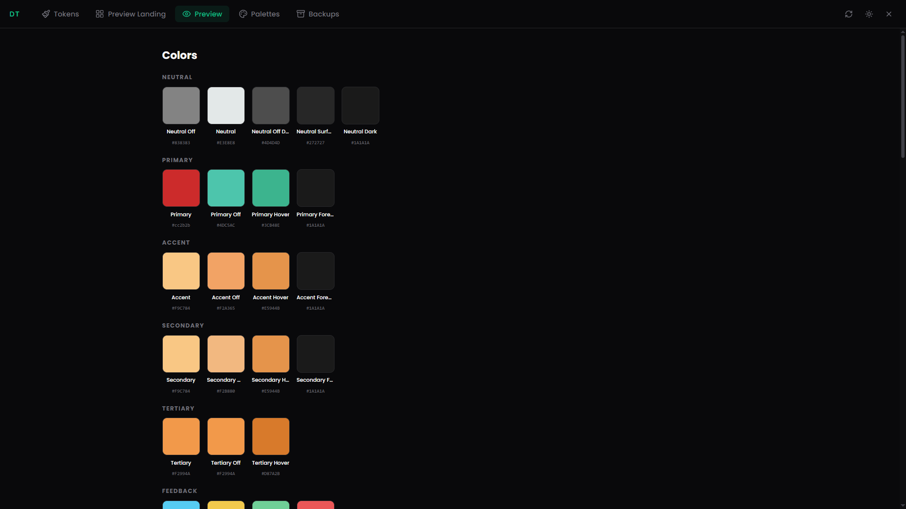
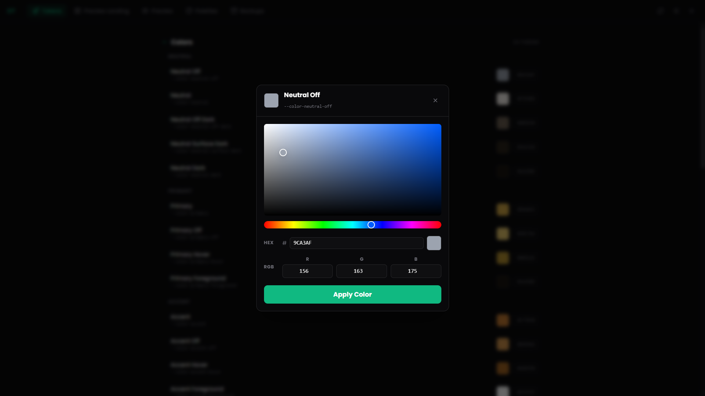
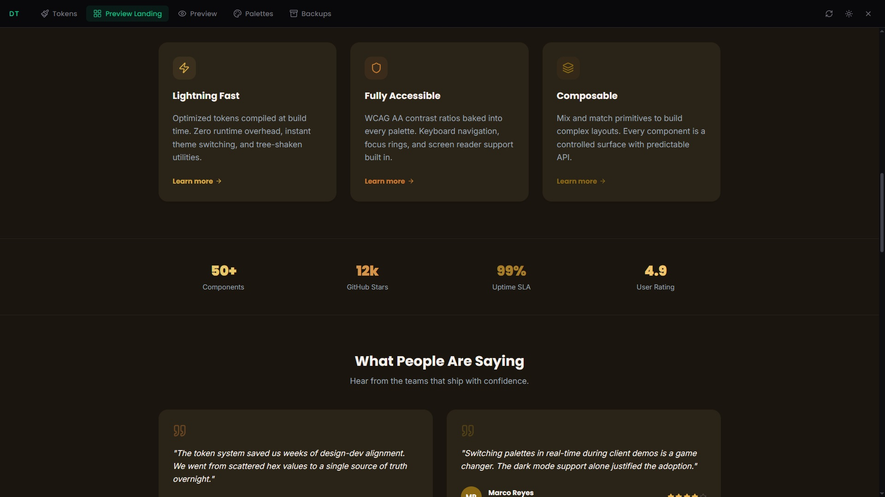
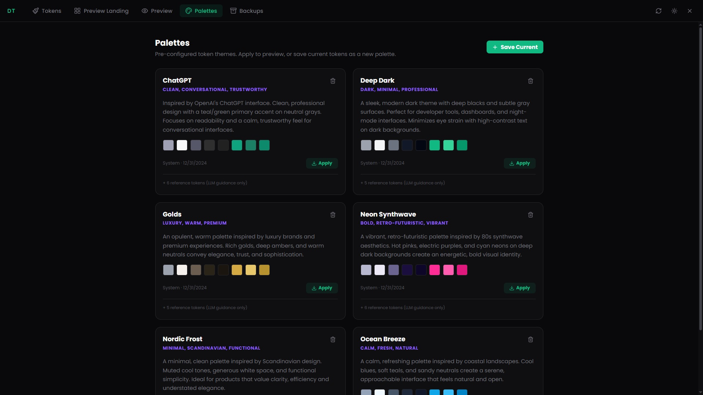

# Design Tokens

Herramienta de debug integrada para inspeccionar, editar y gestionar los design tokens del proyecto en tiempo real. Permite modificar colores, tipografia, spacing, sombras, radios y mas desde el navegador, sin tocar archivos CSS manualmente.

## Como acceder

1. Presionar `Ctrl+Alt+<` para abrir el selector de herramientas de debug.
2. Seleccionar **Design Tokens** con las flechas y `Enter`.
3. El panel se abre como overlay a pantalla completa.

Para cerrar el panel: `Ctrl+Alt+Q` o el boton **X** en la esquina superior derecha.

## Navegacion

El panel tiene 5 pestanas accesibles desde la barra superior:

| Pestana | Descripcion | Atajo |
|---|---|---|
| **Tokens** | Editor de tokens agrupados por categoria | `Ctrl+Alt+1` |
| **Preview Landing** | Landing de muestra que consume todos los tokens en contexto | `Ctrl+Alt+2` |
| **Preview** | Vista raw de las variables CSS actuales | `Ctrl+Alt+3` |
| **Palettes** | Temas preconfigurados listos para aplicar | `Ctrl+Alt+4` |
| **Backups** | Snapshots manuales del estado de tokens | `Ctrl+Alt+5` |

## Tokens

La pestana principal. Muestra todos los tokens organizados por categoria:

- **Colors** — Neutral, Primary, Accent, Secondary y variantes de feedback.
- **Spacing** — Escala de spacing del sistema.
- **Typography** — Font family, weight, sizes.
- **Border Radius** — Escala de redondeos.
- **Elevation** — Sombras y profundidad.
- **Blur, Opacity, Z-Index, Motion** — Tokens de efectos y animacion.

Cada categoria es colapsable. Al hacer click en un token se abre su editor inline. Para tokens de color, se despliega un **color picker** estilo Figma con:

- Selector 2D de saturacion y brillo.
- Slider de hue (espectro 360°).
- Campos HEX y RGB editables.
- Boton **Apply Color** para confirmar.

Los cambios quedan como **pendientes** hasta que se guarden. La barra superior muestra "Unsaved changes" cuando hay ediciones sin persistir.

## Preview Landing

Pagina de landing editorial que demuestra todos los tokens aplicados en contexto real: hero sections, feature cards, botones CTA, testimonios, metricas, tipografia y colores.

Se actualiza en tiempo real al modificar tokens. Util para validar que un cambio de color o spacing no rompe la coherencia visual general.

## Palettes

Temas preconfigurados que aplican un conjunto completo de tokens de una sola vez. Cada paleta incluye nombre, descripcion, tags de orientacion y preview de colores.

### Aplicar una paleta

1. Click en **Apply** en cualquier paleta.
2. El sistema pregunta si se quiere crear un **backup** antes de aplicar (recomendado).
3. Los tokens de la paleta se cargan como cambios pendientes.
4. Click en **Save** en la barra superior para persistir.

### Guardar la configuracion actual como paleta

1. Click en **+ Save Current** (esquina superior derecha).
2. Completar nombre, descripcion y orientacion.
3. La paleta queda disponible para aplicar en el futuro.

### Paletas incluidas

- **ChatGPT** — Clean, conversational, trustworthy.
- **Deep Dark** — Dark, minimal, professional.
- **Golds** — Luxury, warm, premium.
- **Neon Synthwave** — Bold, retro-futuristic, vibrant.
- **Nordic Frost** — Minimal, Scandinavian, functional.
- **Ocean Breeze** — Calm, fresh, natural.

## Backups

Snapshots manuales del estado completo de tokens. Permiten volver a un punto anterior si un cambio no funciono como se esperaba.

### Crear un backup

1. Ir a la pestana **Backups**.
2. Click en **Create Backup**.
3. Asignar un label (ej. "Antes de cambiar paleta") y una razon.
4. El snapshot se guarda con timestamp.

### Restaurar un backup

1. Click en **Restore** en cualquier backup.
2. Los tokens se cargan como cambios pendientes.
3. Click en **Save** para confirmar la restauracion.

## Atajos de teclado

Todos los atajos usan la base `Ctrl+Alt`.

| Atajo | Accion |
|---|---|
| `Ctrl+Alt+1` | Ir a Tokens |
| `Ctrl+Alt+2` | Ir a Preview Landing |
| `Ctrl+Alt+3` | Ir a Preview |
| `Ctrl+Alt+4` | Ir a Palettes |
| `Ctrl+Alt+5` | Ir a Backups |
| `Ctrl+Alt+S` | Guardar cambios pendientes |
| `Ctrl+Alt+Z` | Descartar cambios pendientes |
| `Ctrl+Alt+R` | Re-sincronizar tokens desde CSS |
| `Ctrl+Alt+T` | Alternar dark / light mode |
| `Ctrl+Alt+Q` | Cerrar panel |

## Tipos de token soportados

| Tipo | Ejemplo |
|---|---|
| `color` | Hex via color picker |
| `dimension` | Sizes, spacing (px, rem) |
| `font-family` | Familias tipograficas |
| `font-weight` | Pesos tipograficos |
| `shadow` | Box shadows |
| `blur` | Blur radius |
| `opacity` | Niveles de opacidad |
| `z-index` | Capas de apilamiento |
| `duration` | Duraciones de animacion |
| `easing` | Curvas de animacion |
| `border-radius` | Redondeos |
| `aspect-ratio` | Relaciones de aspecto |

## Flujo tipico

1. Abrir Design Tokens (`Ctrl+Alt+<` → seleccionar).
2. Navegar a **Tokens** y expandir la categoria deseada.
3. Editar tokens (color picker para colores, input para el resto).
4. Verificar en **Preview Landing** que los cambios se ven bien.
5. **Save** para persistir o **Discard** para revertir.
6. Opcionalmente, guardar el estado como **Palette** o **Backup** para reutilizar despues.
