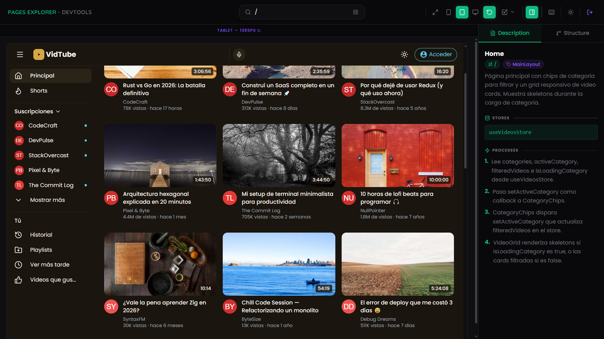
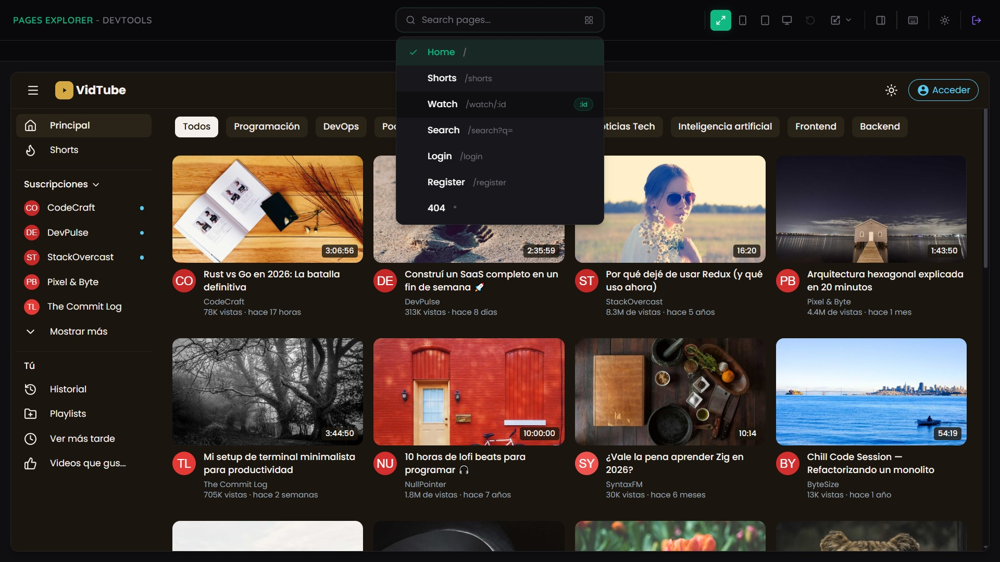
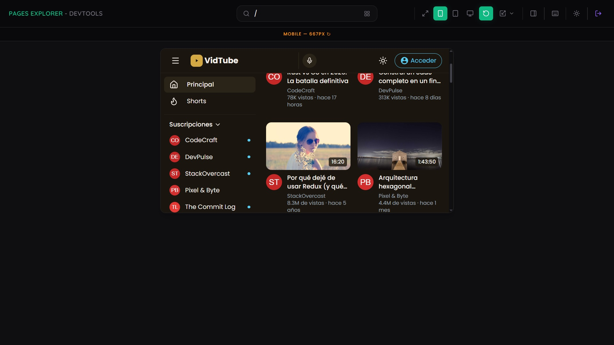
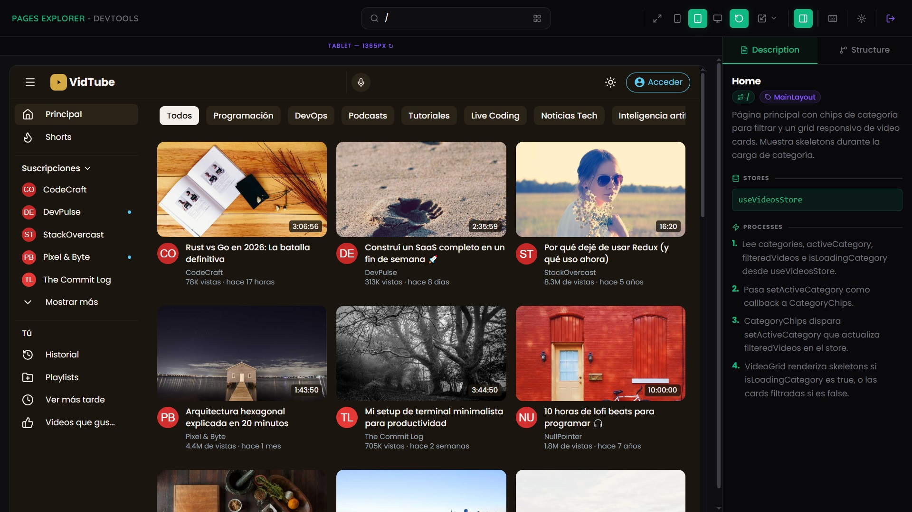
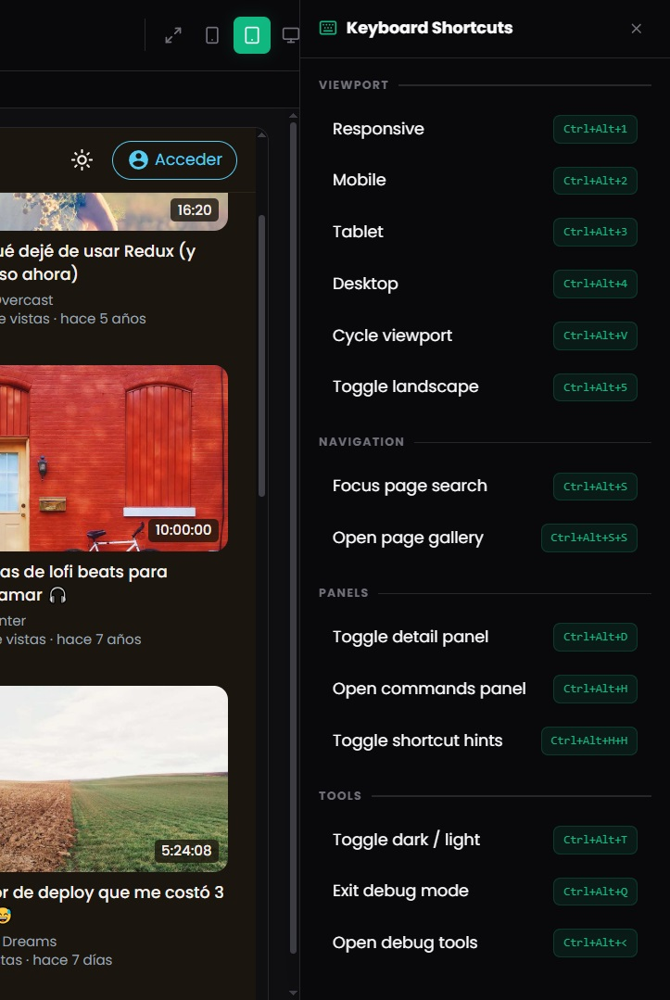

# Pages Explorer

Herramienta de debug integrada para navegar, previsualizar y documentar las paginas del proyecto. Permite simular viewports responsivos, consultar la documentacion de cada ruta y recorrer la app completa sin salir del entorno de desarrollo.

## Como acceder

Hay dos formas de abrir Pages Explorer:

1. **Boton flotante** — Click en el icono de capas que aparece en la esquina inferior derecha de la app.
2. **Atajo global** — `Ctrl+Alt+<` abre el selector de herramientas de debug → seleccionar **Pages Explorer**.

Para cerrar: `Ctrl+Alt+Q` (pide confirmacion) o el boton **X** en la barra superior.

## Interfaz

El panel se divide en tres areas:

### Barra superior

Contiene la navegacion de paginas, selector de viewport y acceso a herramientas.

**Izquierda — Navegacion de paginas:**
- Dropdown con todas las rutas disponibles (Home, Shorts, Watch, Search, Login, Register, 404).
- Barra de busqueda con `Ctrl+Alt+S` para filtrar por nombre o ruta.
- Doble tap `Ctrl+Alt+S+S` para abrir la galeria visual de paginas.

**Centro — Selector de viewport:**
- Botones de preset: Responsive, Mobile, Tablet, Desktop.
- Indicador visual del viewport activo con ancho en pixeles.
- Boton de ciclo para recorrer todos los modos (`Ctrl+Alt+V`).
- Rotacion landscape para mobile y tablet (`Ctrl+Alt+5`).

**Derecha — Herramientas:**
- Panel de atajos de teclado (`Ctrl+Alt+H`).
- Toggle del detail panel (`Ctrl+Alt+D`).
- Alternar dark / light mode (`Ctrl+Alt+T`).
- Salir del modo debug (`Ctrl+Alt+Q`).

### Area de viewport

Renderiza la pagina seleccionada dentro del tamano de viewport elegido.

- **Responsive**: ancho completo, sin restricciones.
- **Mobile / Tablet / Desktop**: renderiza en un iframe aislado con las dimensiones exactas del dispositivo seleccionado.

Cada modo tiene un borde con color distintivo y un label indicando el tipo y ancho en pixeles.

#### Presets de dispositivos

| Categoria | Dispositivos |
|---|---|
| **Mobile** | iPhone SE (375×667), iPhone 14 Pro (393×852), Samsung S21 (360×800) |
| **Tablet** | iPad Mini (768×1024), iPad Pro 11" (834×1194), iPad Pro 12.9" (1024×1366) |
| **Desktop** | Laptop (1366×768), Desktop HD (1920×1080), Desktop 2K (2560×1440) |

### Detail panel (sidebar derecho)

Panel lateral con documentacion de la pagina activa. Se abre con `Ctrl+Alt+D`.

Tiene dos pestanas:

#### Description

Muestra la documentacion de la ruta actual:

- **Titulo y layout** — Nombre de la pagina y layout que la envuelve.
- **Descripcion** — Resumen funcional de la pagina.
- **Stores** — Stores de Zustand que consume la pagina.
- **Processes** — Flujo paso a paso de como funciona la pagina internamente.

#### Structure

Visualizacion del arbol de componentes de la pagina. Muestra la jerarquia del DOM, el nesting de componentes y sus relaciones.

## Atajos de teclado

Todos los atajos usan la base `Ctrl+Alt`. Se pueden consultar en cualquier momento con `Ctrl+Alt+H`.

### Viewport

| Atajo | Accion |
|---|---|
| `Ctrl+Alt+1` | Viewport Responsive |
| `Ctrl+Alt+2` | Viewport Mobile |
| `Ctrl+Alt+3` | Viewport Tablet |
| `Ctrl+Alt+4` | Viewport Desktop |
| `Ctrl+Alt+V` | Ciclar viewports |
| `Ctrl+Alt+5` | Rotar landscape |

### Navegacion

| Atajo | Accion |
|---|---|
| `Ctrl+Alt+S` | Foco en busqueda de paginas |
| `Ctrl+Alt+S+S` | Abrir galeria de paginas |

### Paneles

| Atajo | Accion |
|---|---|
| `Ctrl+Alt+D` | Toggle detail panel |
| `Ctrl+Alt+H` | Abrir panel de atajos |
| `Ctrl+Alt+H+H` | Toggle hints de atajos en botones |

### Herramientas

| Atajo | Accion |
|---|---|
| `Ctrl+Alt+T` | Alternar dark / light mode |
| `Ctrl+Alt+Q` | Salir del modo debug |
| `Ctrl+Alt+<` | Abrir selector de herramientas |

## Flujo tipico

1. Abrir Pages Explorer (boton flotante o `Ctrl+Alt+<`).
2. Seleccionar una pagina desde el dropdown o con la busqueda (`Ctrl+Alt+S`).
3. Elegir un viewport (Mobile, Tablet, Desktop) para verificar responsividad.
4. Abrir el detail panel (`Ctrl+Alt+D`) para consultar la documentacion de la ruta.
5. Ciclar viewports (`Ctrl+Alt+V`) para hacer una revision rapida multi-dispositivo.
6. Rotar a landscape (`Ctrl+Alt+5`) si se necesita validar la orientacion horizontal.
